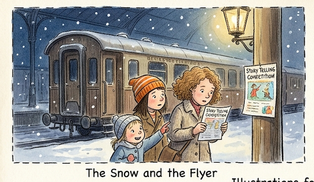
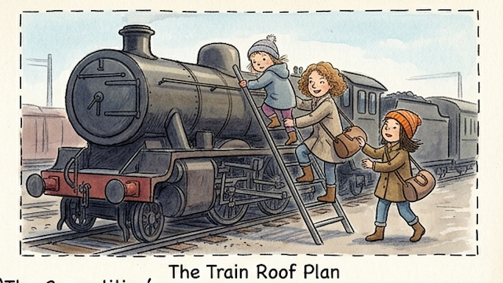
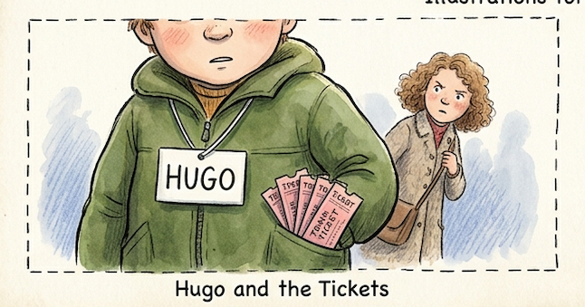
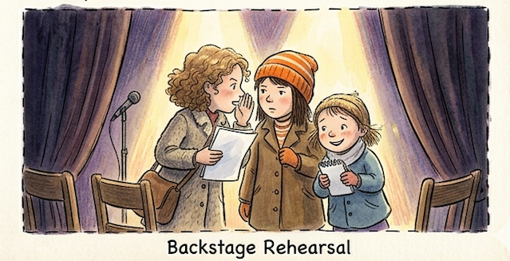

The Competition  
By: Anika

This story takes place in Paris at night, it was lightly snowing and Agnes, Margo, and Edith were walking back to the abandoned apartments in the train station after working at Mr. Tabard's coffee shop.

While they were walking back they saw some flyers for a story telling competition, they almost walked past it until Margo saw that the prize money was $100,000. So, Margo took a flyer and showed it to her siblings when they got back.

They all agreed that they should enter the competition, but the only problem was that the competition was at the other side of Paris.

The girls decided that they would go to work extra early the next morning so they could get more money than usual and afford train tickets. After a few days of hard work, the girls booked their train tickets to get to the competition.

When they got back to their apartment from another hard day of work Agnes, the youngest one, said, "What will our story be?"

That's when they realized they didn't have a story to tell!

So, they spent the whole night coming up with a story. They argued for a while, but finally decided that they would add a twist to "Hansel and Gretel".

The next day they left for another day of work but didn't realize that their door was open. Since their door was open, when they were at the coffee shop, someone named Hugo stole their tickets because he wanted better chances of winning so decided to eliminate some competition. The 3 girls did not know that any of this happened because when they came back the door was closed (not locked), just as they had left it.

The next morning the girls woke up extra early because their train left at 10:00 A.M. They were just doing some last minute packing when Margo yelled "where are our tickets?!", Edith said "I thought you had them!!!".

Then Margo said, "I think someone took them, but don't worry, I have a plan." "What's the plan?", Agnes asked. "Yeah, what's the plan?", Edith said.

Margo said, "I'm not going to tell you right now because if I do you guys won't do it".

The girls almost trusted until they saw the mischievous grin on their sister's face.

When they brought their stuff towards their train Margo said, "Climb up that ladder, no questions." As their sister told them to, they went up the ladder confused.

Then, Margo waited for the perfect moment, and pushed Agnes and Edith on to the train's roof when it was about to leave, she also jumped onto it.

"This way", Margo thought," we will get to the competition without the need of train tickets." Agnes and Edith were really angry when they found out that Margo didn't talk to them first about her plan, but eventually they got over it.

The next morning, they arrived at their competition and spent some time talking to their competitors. One particular competitor caught their eye, though. It was a boy with a name tag labeled Hugo but the unusual thing was that instead of one ticket being in his pocket there were 4!

So, right before the competition started, they reported Hugo to the host of the competition. When the host heard this and saw the proof that they had, he immediately disqualified him.

Right before the competition started, the girls had some snacks (the snacks were free for competitors) because they weren't buying food for the past 2 days, just so they could afford train tickets. They also discussed what they would do with the prize money, but they were stopped in the middle of the conversation because the competition was starting.

The girls went backstage to rehearse one last time before they went on stage. Then they heard the host say, "will Margo, Edith, and Agnes please come on stage." Exited, the girls ran onto stage and took the microphone from the host.

Then they started to tell their story and 10 minutes later, they were done!

The girls sat there nervous because they had to wait a whole hour before they got the results for the competition.

When the results were being announced they held their breath until they heard this: "...... and in first place we have...... Margo, Edith, and Agnes."

The girls jumped up in excitement and collected their prize money... of 500,000 dollars!

When the girls were going back they had nothing to worry about as no one would steal their tickets, and even if someone did they had enough money to buy more!

The next day, when the girls came back they were super excited, because they now had enough money to buy an actual house, lots of furniture, food and water, and best of all their new neighborhood had a store next door where they could all work!

The following night the girls fell asleep on their new beds, exhausted, but satisfied.

...

The End
